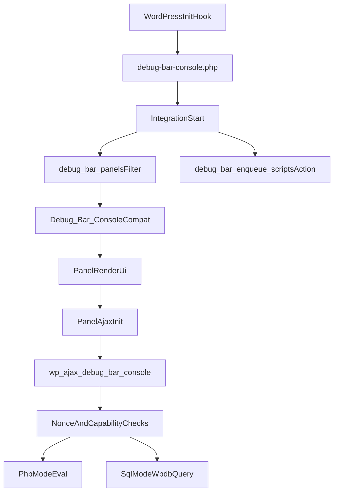

# Architecture

## High-Level Flow

1. WordPress loads `debug-bar-console.php`.
2. On `init`, the plugin loads Composer autoload + `compat.php`, then starts `DebugBarConsole\Integration`.
3. `Integration` hooks into Debug Bar events to register the panel and enqueue assets.
4. Debug Bar instantiates `Debug_Bar_Console` (compat class extending `DebugBarConsole\Panel`).
5. `Panel` renders the UI and initializes `PanelAjax` handler.
6. AJAX requests to `wp_ajax_debug_bar_console` are handled by `PanelAjax::printOutput()`.

## Component Responsibilities

## Bootstrap Layer

- `debug-bar-console.php`
  - Declares plugin metadata and constants (`VERSION`, `FILE`).
  - Boots autoload + compat wiring on `init`.

## Integration Layer

- `src/Integration.php`
  - Registers panel through `debug_bar_panels` filter.
  - Enqueues editor/panel scripts and styles via `debug_bar_enqueue_scripts`.
  - Uses `AssetsHelper::getAssetUrl()` for SCRIPT_DEBUG-aware URLs.

## UI Layer

- `src/Panel.php`
  - Extends `Debug_Bar_Panel`.
  - Defines panel title, visibility, and form/iframe-based output UI.
  - Wires AJAX endpoint via `PanelAjax::init()`.

## Execution Layer

- `src/PanelAjax.php`
  - Registers `wp_ajax_debug_bar_console`.
  - Checks nonce and super-admin capability before execution.
  - Runs PHP snippets with `eval()` when mode is `php`.
  - Executes SQL with `$wpdb->get_results()` when mode is `sql`.
  - Renders formatted SQL tables or raw output.

## Compatibility Layer

- `compat.php`
  - Maintains global `Debug_Bar_Console` class and legacy functions.
  - Routes deprecated legacy calls to namespaced classes.
- `class-debug-bar-console.php`
  - Deprecated shim file that loads `compat.php`.

## Assets

- Source assets live under `src/assets/`.
- Production URLs use minified assets; when `SCRIPT_DEBUG` is enabled, helper maps to `src/` non-minified paths where allowed.

## Data/Control Flow Diagram

